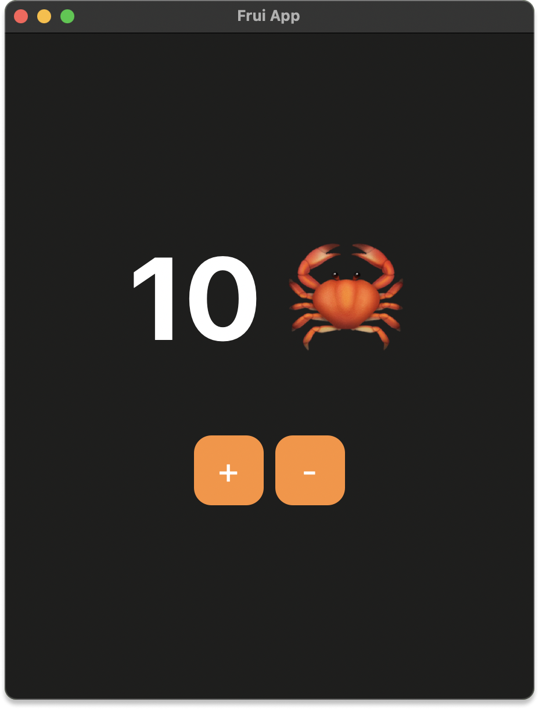

<h1 align="center"></h1>

*<p align="center">Reading: "Fru" as in "fruit" and "i" as in "I" (I am).</p>*

<p align="center">
<a href="https://crates.io/crates/frui"></a>
<a href="https://github.com/fruiframework/frui/blob/main/LICENSE-MIT"></a>
<a href="https://github.com/fruiframework/frui/blob/main/LICENSE-APACHE"></a>
<a href="https://discord.gg/CCVygCAgXR"></a>
</p>

## What is Frui?

Frui is a developer-friendly UI framework that makes building user interfaces easy and productive. It's inspired by Flutter architecture and is written in Rust!

For an introduction see the [announcement](https://github.com/fruiframework/frui-blog/blob/master/posts/001/0.0.1.md).

## Example

```rust

#![feature(type_alias_impl_trait)]

use frui::prelude::*;

#[derive(ViewWidget)]
struct App;

impl ViewWidget for App {
    fn build<'w>(&'w self, _: BuildContext<'w, Self>) -> Self::Widget<'w> {
        Center::child(Text::new("Hello, World!"))
    }
}

fn main() {
    run_app(App);
}
```

## Warning

This framework is still in an experimental phase of development. As such, API changes are inevitable and necessary for the best developer experience. 

Currently, there is very little optimizations happening. Layout and drawing are the least optimized. Many important widgets are yet to be implemented. 

Frui heavily utilizes some of the nightly features to optimize rebuilds of the widget tree and improve the API. Therefore, the Minimum Supported Rust Version is **the latest nightly release** of Rust. This may be a deal-breaker for some.

It is important to know that Frui should not be used to build any serious applications at this point in time.


## Features

*Ok, what's done and what's not?*

- [x] `ViewWidget` (see [`StatelessWidget`](https://api.flutter.dev/flutter/widgets/StatelessWidget-class.html) and [`StatefulWidget`](https://api.flutter.dev/flutter/widgets/StatefulWidget-class.html))
- [x] `InheritedWidget` (see [`InheritedWidget`](https://api.flutter.dev/flutter/widgets/InheritedWidget-class.html))
- [x] `LocalKey` (see [`Key`](https://api.flutter.dev/flutter/foundation/Key-class.html))
- [x] Scheduling state updates
- [x] Basic event detection (`KeyboardEventDetector` / mouse events)
- [x] Basic layout widgets (`Column`, `Row`, `Center`)

###

- [ ] Focus
- [ ] Events
- [ ] Accessibility
- [ ] Z-layers drawing
- [ ] Optimizations:
  - [ ] Widget-rebuilds (based on depth)
  - [ ] Layout
  - [ ] Painting
- [ ] Library of widgets common to all design langauges (provided in `frui_widgets`)
  - [ ] `Column`, `Row`, `Stack`, `Scroll`, ...
  - [ ] `KeyboardListener`, `GestureDetector`, ...
  - [ ] Theming widgets, etc.
- [ ] Officially supported widget library implementing most popular design languages (e.g. `frui_material`, `frui_cupertino`)
- [ ] Documentation and tutorials


## 🦀 Counter - Example

Obligatory crab counter! From `examples/crab_counter.rs`.

```rust

#![feature(type_alias_impl_trait)]

use frui::prelude::*;

mod misc;
use misc::Button;

#[derive(ViewWidget)]
struct CrabCounter;

impl WidgetState for CrabCounter {
    type State = isize;

    fn create_state(&self) -> Self::State { 0 }
}

impl ViewWidget for CrabCounter {
    fn build<'w>(&'w self, ctx: BuildContext<'w, Self>) -> Self::Widget<'w> {
        Column::builder()
            .space_between(60.0)
            .main_axis_size(MainAxisSize::Max)
            .cross_axis_size(CrossAxisSize::Max)
            .main_axis_alignment(MainAxisAlignment::Center)
            .cross_axis_alignment(CrossAxisAlignment::Center)
            .children((
                Text::new(format!("{} 🦀", *ctx.state()))
                    .size(100.0)
                    .weight(FontWeight::BOLD),
                Row::builder()
                    .space_between(10.0)
                    .children((
                        Button {
                            label: Text::new("+").size(30.),
                            on_click: || *ctx.state_mut() += 1,
                        },
                        Button {
                            label: Text::new("-").size(30.),
                            on_click: || *ctx.state_mut() -= 1,
                        },
                    )),
            ))
    }
}

fn main() {
    run_app(CrabCounter);
}
```
<p align="center"></p>

*<p align="center">Crabs counter running on MacOS</p>*

## Credits

Frui wouldn't exist without Flutter and its widget architecture, which inspired Frui's API. Thank you!

Frui also wouldn't exist without prior work done on Druid - which powers most of the back-end. Many widgets share some of the implementation details with it as well. Thank you a lot!


## License

All code in this repository is dual-licensed under either:

* MIT License ([LICENSE-MIT](LICENSE-MIT) or [http://opensource.org/licenses/MIT](http://opensource.org/licenses/MIT))
* Apache License, Version 2.0 ([LICENSE-APACHE](LICENSE-APACHE) or [http://www.apache.org/licenses/LICENSE-2.0](http://www.apache.org/licenses/LICENSE-2.0))
